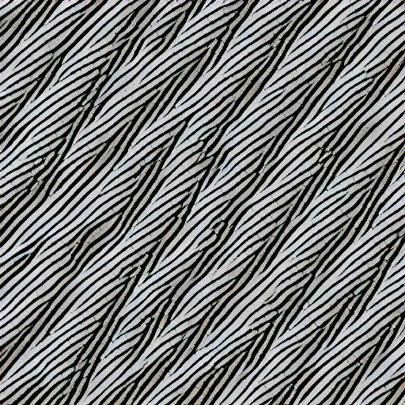
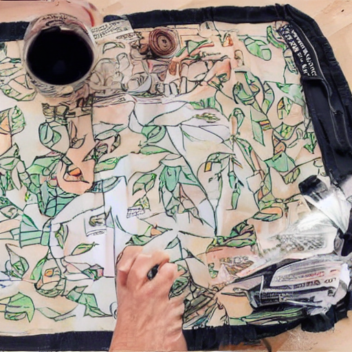
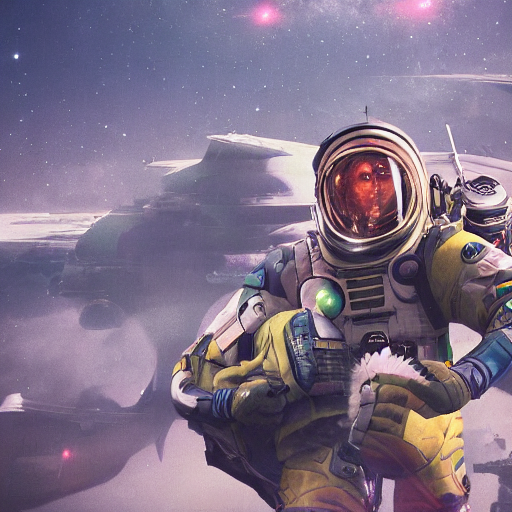
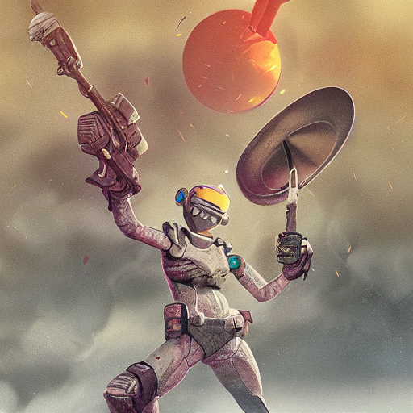
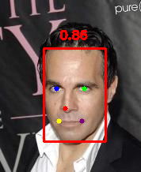
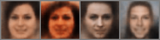
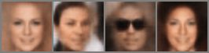
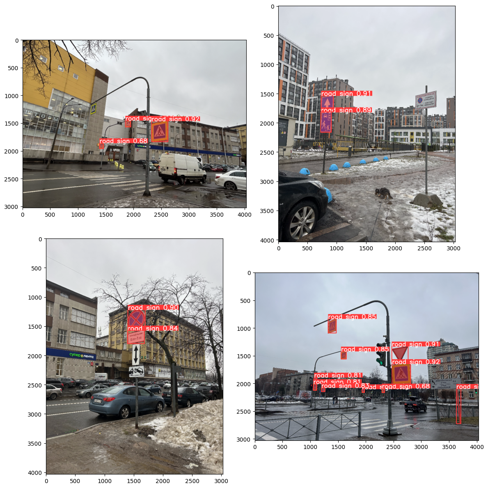
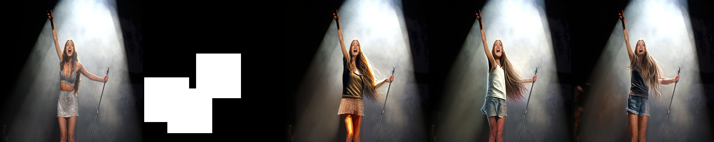
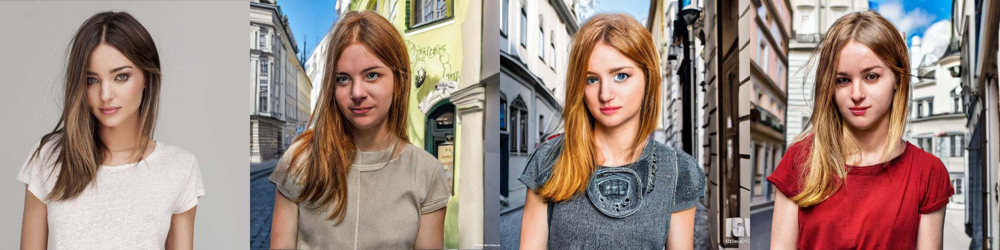

# Generative AI Methods and Technologies — Lab Works

> 📚 Academic project · ITMO University · Generative AI Methods and Technologies course

A collection of labs exploring core generative AI techniques. Several architectures were implemented from scratch (ResNet-34, VAE/CVAE).

## Notebooks

| Notebook | Topic | Key result |
|---|---|---|
| [`text_encoder_replacement_stable_diffusion.ipynb`](text_encoder_replacement_stable_diffusion.ipynb) | Text encoder replacement in Stable Diffusion | CLIP Large best; adapters partially recover quality |
| [`vae_face_generation.ipynb`](vae_face_generation.ipynb) | Face generation with VAE & CVAE from scratch | FID 4.37, conditional generation by gender |
| [`car_color_classification_cnn.ipynb`](car_color_classification_cnn.ipynb) | Car color classification (ResNet-34 from scratch) | Val F1_macro 0.81, 14 classes |
| [`yolov8_road_sign_segmentation_tracking.ipynb`](yolov8_road_sign_segmentation_tracking.ipynb) | Road sign segmentation & tracking | mAP50 0.91 (box), BotSort tracking |
| [`stable_diffusion_inpainting.ipynb`](stable_diffusion_inpainting.ipynb) | SD inpainting & ControlNet + Canny | Mask-type comparison, edge-guided generation |

---

## Text Encoder Replacement in Stable Diffusion

**Notebook:** [`text_encoder_replacement_stable_diffusion.ipynb`](text_encoder_replacement_stable_diffusion.ipynb)

Replaced the default CLIP text encoder in Stable Diffusion v1.5 with alternative encoders and trained lightweight adapters to project their embeddings into the SD latent space.

**Tested encoders:**
- Without adapter: CLIP ViT-L/14 (default), CLIP ViT-B/32, BLIP, Qwen3-4B
- With adapter: CLIP Base + adapter, BLIP + adapter, Qwen + adapter

**Adapter architecture:**
```
Input embeddings → Linear(input_dim, 3072) → ReLU → Linear(3072, 768) → Output
```
Trained on 38K text-embedding pairs to project alternative encoder embeddings into the CLIP Large latent space.

**Results:**

| Configuration | CLIP Score ↑ | CLIPIQA ↑ | NIQE ↓ |
|---|---|---|---|
| **CLIP Large (default)** | **27.7** | 0.76 | **4.2** |
| CLIP Base (no adapter) | 13.1 | 0.46 | 6.9 |
| BLIP (no adapter) | 12.1 | 0.63 | 4.6 |
| Qwen (no adapter) | 16.8 | 0.22 | 7.7 |
| CLIP Base + adapter | 20.9 | **0.72** | 3.8 |
| **BLIP + adapter** | 16.9 | **0.79** | 4.7 |
| Qwen + adapter | 11.6 | 0.61 | 6.4 |

**Conclusion:** CLIP Large remains best for prompt adherence (highest CLIP Score). BLIP + adapter achieves the best perceptual quality (CLIPIQA 0.79) but loses semantic alignment. Qwen degrades both metrics significantly.

**Tech:** PyTorch, Diffusers, Transformers (CLIP, Qwen, BLIP), pyiqa, torchmetrics

**Example:** 
*Prompt: "Astronaut in a jungle, cold color palette, muted colors, detailed, 8k"*

|  | CLIP Base | BLIP |
|---|---|---|
| **No adapter** |  |  |
| **With adapter** |  |  |

---

## Face Generation with VAE (implemented from scratch)

**Notebook:** [`vae_face_generation.ipynb`](vae_face_generation.ipynb)

**Implemented VAE and Conditional VAE from scratch** — Encoder, Decoder, reparametrization trick, loss function — and trained both on CelebA faces.

**865,189 parameters** · latent_dim = 100 (VAE) / 512 (CVAE)

**Two setups:**

| Setup | latent_dim | Condition | Val FID ↓ | Val IS ↑ |
|---|---|---|---|---|
| **Unconditional VAE** | 100 | — | 4.51 | 1.04 |
| **Conditional VAE (CVAE)** | 512 | Gender label (±1) | **4.37** | 1.03 |

- **Unconditional VAE** — generates random faces from CelebA distribution
- **CVAE** — generates faces conditioned on gender (label = +1 / −1), allowing controlled generation

Both setups trained for 60 epochs on CelebA.

**Data preprocessing:** Used YOLOv8n-face to detect faces and extract 5 facial keypoints (eyes, nose, mouth corners), then cropped faces centered on keypoint centroid and resized to 64×64.
<p align="center">
  
</p>

**Tech:** PyTorch, YOLOv8-face (detection + keypoints), torchmetrics (FID, IS)

**Resulting generations:**

<p align="center">
  
  
  
</p>

---

## Car Color Classification with CNN (ResNet-34 from scratch)

**Notebook:** [`car_color_classification_cnn.ipynb`](car_color_classification_cnn.ipynb)

**Built a ResNet-34 from scratch** and compared with pretrained ResNet-34 and ViT-B/16 on 14-class car color classification.

**Dataset:** ~60K car images, 14 color labels, class balancing via oversampling, Albumentations augmentations.

**Results:**

| Model | Val Accuracy | Val F1_macro | Epochs |
|---|---|---|---|
| ResNet-34 (from scratch) | 92.06% | 0.8066 | 36 |
| **Pretrained ResNet-34** | **92.19%** | **0.8103** | 19 (early stop) |
| Pretrained ViT-B/16 | 91.79% | 0.8009 | 2 |

All three models converge to similar performance (~0.80 F1_macro). The from-scratch ResNet-34 matches pretrained models, validating the custom implementation.

**Tech:** PyTorch, torchvision, Albumentations, scikit-learn

---

## Road Sign Segmentation & Tracking (YOLOv8 + BotSort)

**Notebook:** [`yolov8_road_sign_segmentation_tracking.ipynb`](yolov8_road_sign_segmentation_tracking.ipynb)

Fine-tuned YOLOv8n-seg on a custom Russian road sign dataset and applied BotSort multi-object tracking on dashcam video.

**What was done:**
- Fine-tuned YOLOv8n-seg (3.3M params) for instance segmentation (80 epochs, 960px)
- Integrated BotSort tracker (with ReID) for video tracking

**Results (best checkpoint):**

| Metric | Box | Mask |
|---|---|---|
| Precision | 0.942 | 0.936 |
| Recall | 0.823 | 0.808 |
| mAP50 | **0.910** | **0.901** |
| mAP50-95 | 0.708 | 0.597 |

**Tech:** Ultralytics YOLOv8, BoxMOT (BotSort), OpenCV, PyTorch

<p align="center">
  
</p>

---

## Stable Diffusion Inpainting & ControlNet + Canny

**Notebook:** [`stable_diffusion_inpainting.ipynb`](stable_diffusion_inpainting.ipynb)

**Part 1 — Inpainting.** Explored prompt-guided inpainting with SD v1.5 using various mask types (small square, long thin, large area) on real photos.

**Part 2 — ControlNet + Canny + IP-Adapter.** Used Canny edge detection as a structural guide for ControlNet-conditioned generation, combined with IP-Adapter for style transfer. Tested with both SD v1.5 and OpenJourney models.

**What was done:**
- Generated random masks with configurable aspect ratio and area; applied SD inpainting with text prompts
- Extracted Canny edges from input photos and used them as ControlNet conditioning
- Combined ControlNet (structure) + IP-Adapter (style) for controlled image generation
- Compared SD v1.5 vs OpenJourney as base models

**Tech:** Diffusers (AutoPipelineForInpainting, StableDiffusionControlNetPipeline), ControlNet (sd-controlnet-canny), IP-Adapter, controlnet_aux

**Inpainting:**
<p align="center">
  
   
</p>

**ControlNet:**
<p align="center">
  
</p>